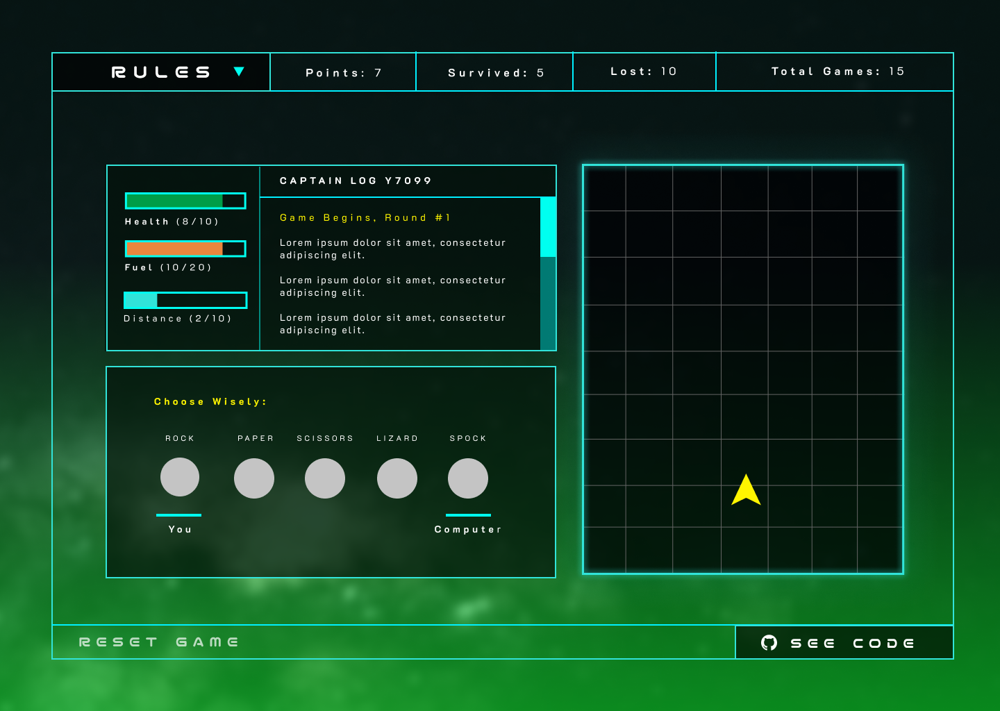

# Rock Paper Scissors (Lizard Spock)

- This is a refresher project on Javascript after mostly relying on JQuery in the past. 
- The project also serves as practice to store and commit code to github.

## About

**Task:** Build a Rock, Paper, Scissors game with a UI from the [Odin Project](https://www.theodinproject.com/lessons/foundations-revisiting-rock-paper-scissors) 
with my own spin on it.

**Concept:** Scifi-inspired, I wanted to make a futuristic UI where the player plays against the AI to save the "crew" from disaster. 
It is a simple game at heart (and not very fun), but it was good practice at writing a variety of JS functions to fullfill the necessary components of the interface.

**Challenge:** Included a canvas component as I had no prior experience with it. While the result is imperfect, 
it was a valuable exploration that introduced canvas and JS classes. 

**Design:** Created a mobile and desktop layout in Figma. Icons for the game were created in Illustrator. The image below is the final desktop/tablet layout. 
Initially, there was a space for where the computer's selection would go; however, showing an indicator on the players and computers selection within 
the same space had better flow and utilized the space better.

